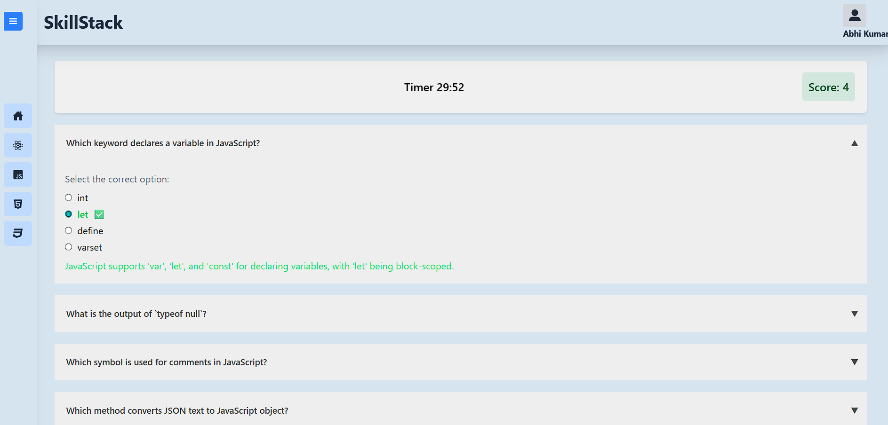

# Quiz App using React

This is a React-based quiz application that displays questions in an interactive accordion format. Each question reveals multiple-choice options when expanded, allows the user to select an answer, and provides immediate feedback with color-coded responses.

## 🔧 Features
Fetches questions from an API

Expand/collapse each question with an accordion UI

Highlights correct/incorrect options on selection

Responsive and mobile-friendly design

Clean and modular React component structure

## 🚀 Tech Stack
React.js

Axios for API requests from backend

Tailwind CSS

Node.js backend (for serving question data)

## 📦 Installation
Clone the repository
##### for frontend:
1. cd frontend
2. Install dependencies with `npm install`
3. Start the development server with `npm run dev`
4. Open your browser and go to `http://localhost:5173`

##### for backend:
1. cd backend
2. Install dependencies with `npm install`
3. Start the server with `npm run dev`

## Screenshots

